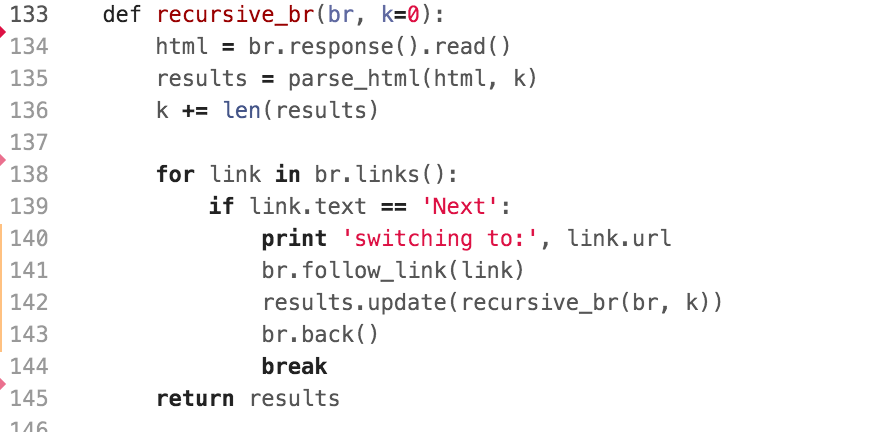
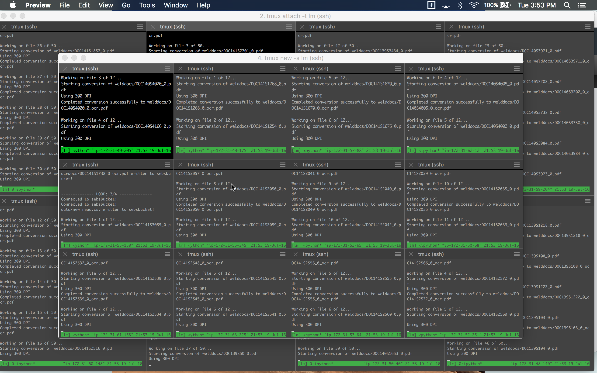
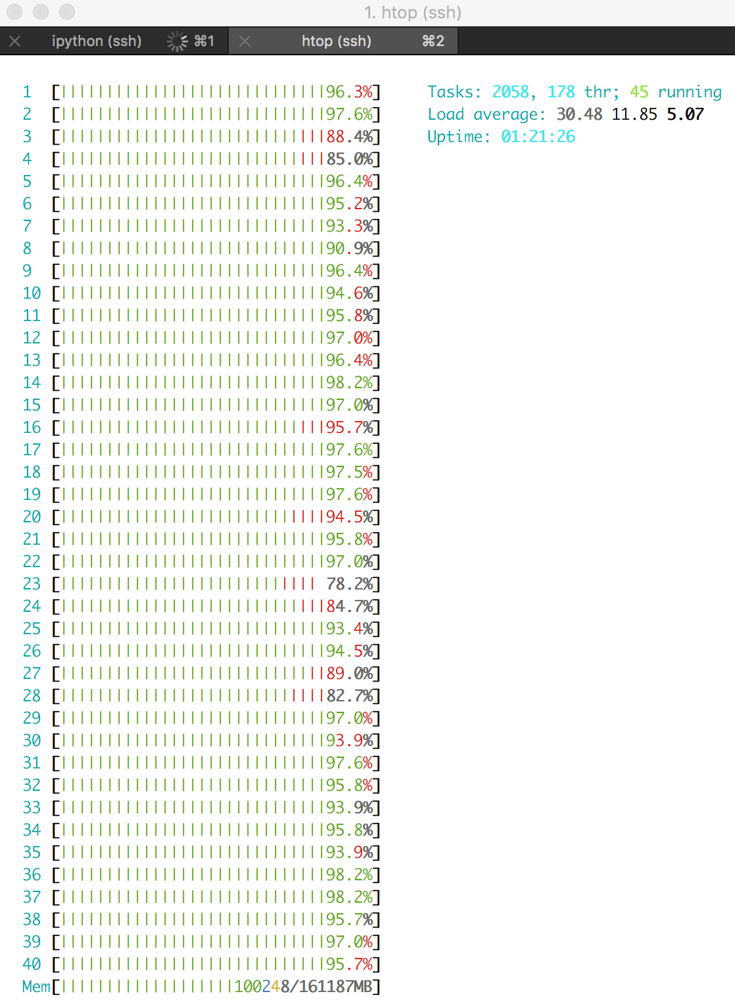
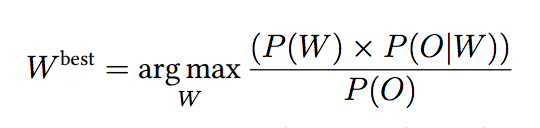
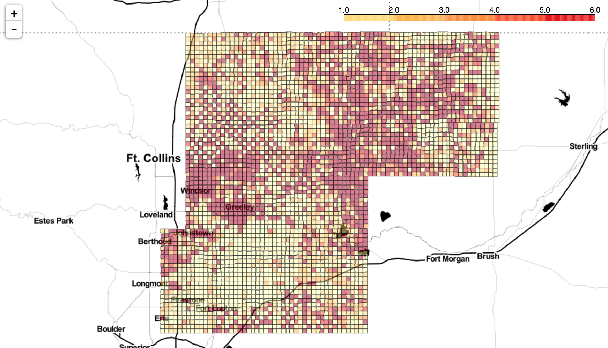

# Virtual Landman
# 

Scrape Oil and Gas leases from  [Weld County Website](https://searchicris.co.weld.co.us/recorder/web/login.jsp?submit=I+Acknowledge) using Mechanize, Pytesseract, and Pypdfocr. Use lease information to determine areas of land that have expired and are not held by production.
___
- [Scraping](#scraping)
    - [Getting Document Numbers](#getting-document-numbers)
    - [Storing in Mongo](#storing-in-mongo)
- [File Acquisition](#file-acquisition)
    - [EC2 & S3](#ec2-&-s3)
- [OCR workflow](#ocr-workflow)
- [Text Extraction and Evaluation](#text-extraction-and-evalution)
- [Unsupervised Text Segmentation](#unsupervised-text-segmentation)
- [Word Scanning Algorithm](#word-scanning-algorithm)
- [Profit](#profit)

___

## Scraping
scraping was peformed on a T2.micro EC2 instance with the following libraries
```
pymongo
bs4
mechanize
cookielib
```
___
### Getting document numbers
After accessing the Weld County website with valid credentials, I partitioned my workflow into successive days since 2006. Using mechanize, I filled out the search form to only show me documents for the following:
```
'ABSTRACTLSE' - Abstraction of Lease
'MEMOLSE' - Memorandom of Lease
'OGLSE' - Oil & Gas Lease
'OGLSEASN' - Oil & Gas Lease Assignment
```
BeautifulSoup was used to extract the document number along with any legal information found through the search.

For search results with more than one page, I programmed a recursive browser to find any following pages.
# 
___
### Storing in Mongo
Local storage of document information was stored in MongoDB using pymongo client. Database was referenced during each iteration of scraping for latest date scraped to.
___
## File Acquisition
The results stored in Mongo were compiled into a pandas data frame that was stored on S3. Mechanize was used to navigate forms to the document download page. A single T2.Micro instance was used to download all documents by downloading 50 documents at a time, uploading to S3, and purging memory-- repeat.
___
### EC2 & S3
### 
Throughout this project, I took advantage of the high bandwith between EC2 instances and S3 to monitor my workflow and keep track of documents that had been processed. A single instance would sync with a pandas data frame using the AWS tools in [LM_AWS](LM/LM_AWS.py) and update the documents processed.
___
## OCR Workflow
## 
Since Pypdfocr already takes advantage of multiple cores on a computer, I was forced to use multiple machines to speed up the OCR process of 50,000 documents. At the peak I had 20 EC2 instances using S3 to distribute the workflow.

## Text Extraction and Evaluation
Text operations were performed using a m4.10xlarge instance with 40 cores and 160GB of memory.
## 
___
## Unsupervised Text Segmentation
It became clear that OCR programs for PDFs did not produce readable or perfect text documents. The major crux of my project involved the text segmentation of these documents. This paper was a huge help: [paper](http://www.cl.uzh.ch/dam/jcr:00000000-6a77-a254-0000-000035371a35/Masters_Thesis_Lenz_Furrer.pdf)
___
## Word Scanning algorithm
I used a combination of the unsupervised text segmentation algorthimn, a curated dictionary of lease vocabulary, and a bayseian approach to n-gram combinations to clean up the text documents.
### 
___
## Profit
Here is the final plot of lease frequency in Weld County. Through text extraction, I was also able to access the terms of the lease, the royalty give to the landholder, and the kicker associated with lease expiration.
#

___

Please feel free to contact me with any questions on the project.
seb.estenssoro@gmail.com
